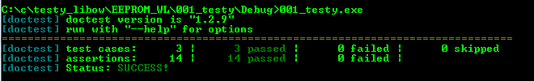

# EEPROM_WL

Library with EEPROM WEAR LEVELING implementation.

# Tests

Library is (almost :p ) fully tested with doctest framework.

Result from tests:

And report from test coverage:

# todo

* more info in readme file